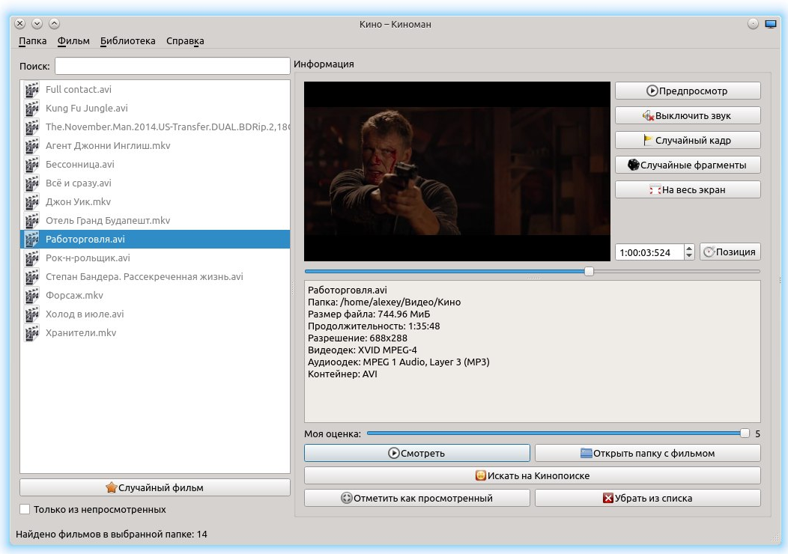

# Киноман
Программа создана для работы с коллекцией фильмов на жёстком диске. Помогает выбрать среди имеющихся фильмов фильм для просмотра.  
Имеются сборки для Windows (x86, статическая линковка), и  Linux (Ubuntu 18.04) (amd64, динамическая линковка).  
Написана на **C++** с использованием **Qt 5**, среда разработки - Qt Creator.  
Основные работы по написанию программы велись мною после второго курса, летом 2014-го года. Моей целью было изучение C++ и Qt.  
## Возможности:  
- поиск всех фильмов в выбранной пользователем папке, а также во всех вложенных в неё папках;
- выбор случайного фильма;
- отметка фильма как просмотренный/непросмотренный;
- поиск по названию файла информации о фильме на "Кинопоиске";
- отображение в панели сбоку предпросмотра фильма;
- отображение размера файла, продолжительности, разрешения видео;
- переход к случайному кадру в предпросмотре;
- показ случайных трёхсекундных фрагментов фильма;  
- и т.д.  

## Требования:  
- ОС **Windows**, **GNU/Linux**;  
- установленная библиотека **Qt 5**, в т.ч. Qt Multimedia;
- поддержка аппаратного ускорения;
- набор медиакодеков, в Linux для работы предпросмотра необходим *gstreamer0.10-ffmpeg*.  

  
Барашков А.А., 2014
